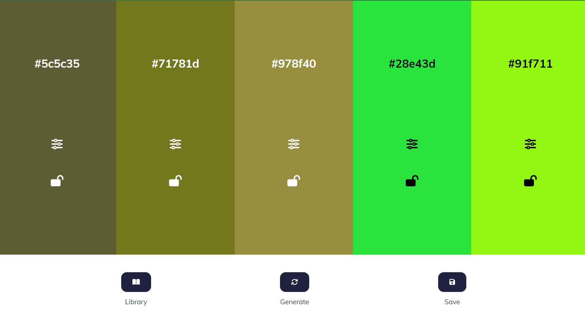

# Color palette project

This is a personal project. I've build a custom color palet where you can generate a random palete with five colors and for each color you can change hue, brightness and saturation.
If you want you can block one or more color that you like anche change other.

In the end you can save you palette click one save and you can copy color code click on it.

### Screenshot

### Links

- Live Site URL: https://ephemeral-gaufre-31548a.netlify.app/

## My process

### Built with

- Semantic HTML5 markup
- CSS custom properties
- fontawesone for icon
- chromaJs to manage color code
- custom JavaScript code
- google font